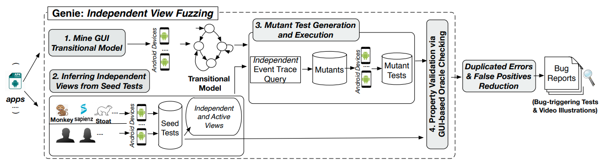

# Genie

We introduce *independent view fuzzing*, a novel, fully automated approach for detecting non-crashing 
functional bugs in Android apps. 
We have realized this approach as a research prototype tool, *Genie*. 
To our knowledge, Genie is the *first* work to generate automated test oracles,
which are not limited to specific functional properties, for Android apps.

*You can find more about our work on testing/analyzing Android apps at this [website](https://tingsu.github.io/files/mobile-app-analysis.html)*.

# Publication

[1] ["Fully Automated Functional Fuzzing of Android Apps for Detecting Non-Crashing Logic Bugs"](https://tingsu.github.io/files/oopsla21-Genie.pdf)
Ting Su, Yichen Yan, Jue Wang, Jingling Sun, Yiheng Xiong, Geguang Pu, Ke Wang, Zhendong Su. In SPLASH/OOPSLA 2021. ([talk video](https://youtu.be/RoOJ5s1dh-w))

```
@article{10.1145/3485533,
   author = {Su, Ting and Yan, Yichen and Wang, Jue and Sun, Jingling and Xiong, Yiheng and Pu, Geguang and Wang, Ke and Su, Zhendong},
   title = {Fully Automated Functional Fuzzing of Android Apps for Detecting Non-Crashing Logic Bugs},
   year = {2021},
   issue_date = {October 2021},
   volume = {5},
   number = {OOPSLA},
   doi = {10.1145/3485533},
   journal = {Proc. ACM Program. Lang.},
   month = oct,
   articleno = {156},
   numpages = {31}
}
```
# Genie's workflow

Genie operates in the four main steps (see the picture below): 
1. mining a GUI transitional model from the app;
2. generating a set of random seed tests and executing each seed test to infer
independent views (In principle, the seed tests also could come from human or existing test generation tools);
3. leveraging the independent views and the transitional model to guide the generation of mutant
tests and executing them; and 
4. comparing each seed test and its corresponding mutant tests
to identify property violations.

Finally, Genie adopts a bug report reducer to remove duplicated
reported errors and trivial false positives, and ranks the remaining distinct bug reports according
to their occurrences for manual confirmation. 



# Running Environment 

Genie is built upon [Droidbot](https://github.com/honeynet/droidbot) and [Stoat](https://github.com/tingsu/Stoat). Basically, you can follow the setup instruction of [Droidbot](https://github.com/honeynet/droidbot) to setup Genie.

We summarize the major setup instructions as follows:

## Prerequisite

1. `Python` (both 2 and 3 are supported)
2. `Java`
3. `Android SDK`
4. Add `platform_tools` directory in Android SDK to `PATH`

## How to install

Clone this repo and intall with `pip`:

```shell
git clone git@github.com:functional-fuzzing-android-apps/home.git
cd Genie/
pip install -e .   # if failed, you can execute "sudo pip3 install -e ."
```

# Quick Start

## Step 1: Setup and Preparation

Create a fresh Android 6.0 emulator (Genie should be able to work on other Android versions):

```
avdmanager create avd --force --name base --package 'system-images;android-23;google_apis;x86' --abi google_apis/x86 --sdcard 512M --device 'Nexus 7'    # create an avd named "base"
```

Modify the fresh emulator for Genie (add files into sdcard and remove unnecessary default apps):

```
emulator -port 5554 -avd base & 
python3 -m deploy.emulator init -s emulator-5554  # if you are not under "Genie", you should execute "cd Genie/"
```

## Step 2: Mine GUI transitional model, generate seed and mutant tests 

We provide a script to automatically start an Android emulator, mine GUI transitional model, generate 
seed tests and the corresponding mutants.

```
python3 -m deploy.prerun --avd base --apk apps_for_test/de.rampro.activitydiary_118.apk -o ./tmp-diary --model-construction --seed-generation --mutant-generation [--no-headless] [--script script_samples/user_script.json] [--offset 1]
```

Here,

``--avd``: the name of Android emulator

``--apk``: the file path of apk 

``-o``: the output directory

``--model-construction``: mine the GUI transitional model

``--seed-generation``: generate seed tests

``--mutant-generation``: generate mutant tests

``--script``: the optional file path of user-defined script used for helping mining the GUI transitional model, which contains a sequence of input events 
(e.g., bypass welcome page, login user account). You can find some samples under ``script_samples`` (e.g., ``pass_login_script.json``, ``pass_welcome_script.json``).

Other options:

``--model-events-count``: the number of events allocated for mining the GUI transitional model, default value: `2000`

``--seeds-count``: the number of random seed tests to be generated, default value: `20`

``--mutants-per-pos``: the number of mutants to be generated at each insertion position of seed tests, default value: `200`

Other configurations ready for use include ``--small``: ``(100, 2, 15)`` and ``--big``: ``(3200, 100, 300)``

## Step 3: Execute mutant tests in parallel 

We currently support running mutant tests on a number of Android emulators in parallel. Note that this step does
not do oracle checking.

```
python3 -m deploy.start --avd base -n 8 --apk apps_for_test/de.rampro.activitydiary_118.apk -o ./tmp-diary/ --no-coverage --timeout 900 [--no-headless] [--offset 2] [--script script_samples/diary_activity_ignore_view_diffs_script.json]
```

Here,

``-n N``: number of emulators/devices that will be used for distributed testing

``--offset N``: specify the starting emulator serial number. If N=1, starting from ``emulator-5556``

``--timeout``: the maximum allowed testing time allocated for each mutant test. If timeouts, we will run the mutant one more time and give up if it timeouts again.

``--script``: the optional script that specifies which views or the order of children views can be ignored when do oracle checking (this file is very important to reduce false positives).

``--no-headless``: do not hide the emulators 

Other options:

``--no-trie-reduce``: do not use trie to prune infeasible mutant tests (By default, we do not add this option. We use trie to prune infeasible mutant tests.)

``--no-trie-load``: do not load trie data from previous log (By default, we do not add this option. We load trie data from previous run.)

``--no-skip``: do not skip any executed mutant tests (By default, we do not add this option. We will skip any executed mutant tests when we restart and continue the fuzzing.)

``--no-coverage``: do not dump coverage of mutant tests (By default, we do not add this option. We will dump coverage for each mutant test.)

``--seeds-to-run``: the default value is ``all`` (run all mutant tests from all the seed tests), 
or specify the ids of the seed tests to run, like ``'1;2;3'`` (run all the mutant tests of the seed tests with ids 1, 2, 3, **remember to add quotes**)

``--test-single-mutant`` or ``--debug``: specify the directory (relative or abosolute directory path) of one single mutant to run, this implies `--no-skip`

``--interval``: interval in seconds between each two events (Default: 0)

``--trie-delete``: delete infeasible mutants according to the trie structure during fuzzing

Note: In some cases, we may hope to rerun the mutants of some specific seeds, we can simply append ``--no-skip`` to the original command line.  But if we also add
``--no-trie-reduce``, then all the mutants will be executed again but will not use the previous trie to prune unreplayable mutants. Another way is to manually
delete the corresponding log files and rerun.

### Outputs of mutant execution 

``tmp-diary/`` -- the output directory (including the GUI transitional model, seed tests, mutant tests, etc)

``tmp-diary/seed-tests/``  -- data of all randomly generated seed tests

``tmp-diary/seed-tests/seed-test-1/`` -- data of the seed test and its corresponding mutants

``tmp-diary/seed-tests/seed-test-1/mutant-0-1`` -- data of the mutant test


## Step 4. Oracle checking, reduce false positives and merge similar reported errors


```
python3 -m droidbot.postprocess -o ./tmp-diary/ --apk apps_for_test/de.rampro.activitydiary_118.apk --do-oracle-checking --merge-checking-results --cores 10 [-f script_samples/app-ActivityDiary-script/checking_config.json] 
```

Here,

``--do-oracle-checking``: do the oracle checking on all executed mutant test

``--merge-checking-results``: merge the oracle checking results for all mutants which have finished oracle checking to
reduce duplicated reported errors

``-f CONFIG_FILE``: the oracle checking configuration file

``--skip``: Do skip mutants or seeds which have finished oracle checking or merging checking results based on 
all `<-o>/oracle-checking-<time>.log`or `<-o>/merge-checking-<time>.log`. By default, we will redo the oracle checking
and merging checking results.

``--cores NUM_OF_CORES``: specify the number of cores which can be used for oracle checking and merging results in parallel

``--mutant``: the specific mutant to do oracle checking

``--seeds``: the specific seed test id, e.g., "1;2;3" to do oracle checking and merging checking results


Output Report, e.g.,

``
./tmp-diary/merged_results_xxx_s1,s2...csv
``

The report includes:
 
 - ``#mutants`` and ``#executed_mutants``
 
 - ``crash errors`` and ``semantic errors``

We can focus on ``Crash Errors`` and ``Semantic Errors``.

Some important files:

``tmp-diary/seed-tests/seed-test-1/mutant-0-1/index_x.html`` -- the visualized bug report with 
annotation info to highlight the reported errors

``tmp-diary/seed-tests/seed-test-1/mutant-0-1/checking_result.json`` -- the detailed results of oracle checking

# Detailed Usage of Genie

If you want to know more how to use and debug Genie, you can find the detailed instructions [here](https://github.com/functional-fuzzing-android-apps/home/blob/master/DEVELOPER.md).


# How to inspect Genie-generated bug report?

Genie provides a visualization module to ease manual confirmation of reported bugs. 
We illustrate a bug report example of ActivityDiary: 

Bug summary ([link](https://github.com/functional-fuzzing-android-apps/home/issues/10))

Bug report generated by Genie during functional fuzzing ([link](https://functional-fuzzing-android-apps.github.io/home/app-ActivityDiary-bug-report-example/seed-tests/seed-test-7/mutant-659/index_aligned_9.html))

Explanation:

1. The left column is the seed test (randomly generated), while the right column is the mutant test. The two tests are aligned to ease inspection (the indpendent event trace is representd by trace [4,5] in the mutant test).

2. For each test, the GUI pages denote the layouts (GUI states), and the text besides each page denotes the GUI event that works on the previous page and leads to the current page. The icon on top of the text is the receiver view of the event on the previous page. 

3. The oracle checking checking is conducted on the layouts highlighted by the two red boxes. The GUI consistencies are highlighted by small red boxes on the corresponding GUI pages. Due to the GUI effect of seed test, i.e., chaning from ``<No Activity>`` to ``Empty Activity`` is not contained in that of mutant test, i.e., chaning from ``Gardening`` to ``<No Activity>``.  Thus, a likely functional bug was detected and it is a true positve.

4. Model, seed, and mutant visualization

- The concrete GUI transitional model ([link](https://functional-fuzzing-android-apps.github.io/home/app-ActivityDiary-bug-report-example/index.html));  

- the abstracted GUI transitional model ([link](https://functional-fuzzing-android-apps.github.io/home/app-ActivityDiary-bug-report-example/index_cluster.html));  

- the seed test (``seed-test-7`` in this case) ([link](https://functional-fuzzing-android-apps.github.io/home/app-ActivityDiary-bug-report-example/seed-tests/seed-test-7/index.html)); 

- the generated mutant test (``mutant-659`` in this case) from the seed test at 3th insertion position: ([link](https://functional-fuzzing-android-apps.github.io/home/app-ActivityDiary-bug-report-example/seed-tests/seed-test-7/mutant-659/index.html)).

---


## Contacts

* [Ting Su](http://tingsu.github.io/) 
* [Yichen Yan](https://scholar.google.com.sg/citations?user=MCOguzYAAAAJ) 
* [Jue Wang](https://cv.juewang.info/)
* [Zhendong Su](https://people.inf.ethz.ch/suz/)


